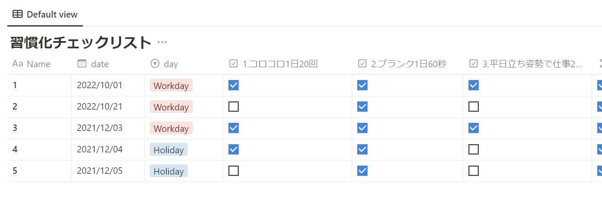
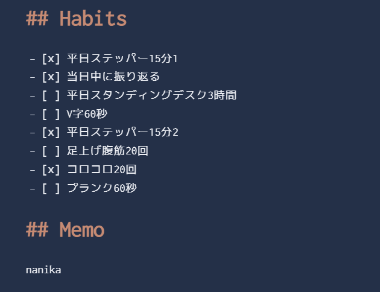

# markdown-importer

いろんなデータをObsidianのMarkdownに集約するためのスクリプト集

基本的に使いきり

## notion_habits2daily_note.js

Notionに日毎で習慣化のプロパティが存在するページがあり、それを集約したDatabaseがある

[習慣化達成率](https://swfz.notion.site/2e74942314234651bc3a5eb53cac6b47)

Databaseに存在する各日にちの習慣化リストを取得しObsidianのDailyNoteにコンテンツとして追加する

- notion


このデータを

- daily note


こんな感じにする

### 使い方
- 環境変数`NOTION_DATABASE_ID` にDatabaseIDを設定
- 環境変数`NOTION_TOKEN` にAPI Tokenを設定
- 実行
    - DailyNoteが存在するディレクトリはコマンドライン引数で渡す

```
node notion_habits2daily_note.js /path/to/obsidian/daily_note
```

### 他
- ObsidianのDailyNoteはYYYY-MM-DD.mdというファイル名で存在する
- DailyNoteのファイルがない場合は新たに作成し習慣化の項目を挿入する
- ファイル内に`Memo`というヘッダーがある場合
    - `Memo`の前に`Habits`という項目を入れて習慣化リストを入れ込む
- ファイル内に`Memo`というヘッダーがない場合
    - ファイルの末尾に追加する
- 過去データの入れ込みで一度きりの実行を想定しているため冪等性などは考慮していない


## notion_journal2daily_note.js

NotionのJournalデータを記録しているDatabaseがある

そのデータをObsidianのDailyNoteに追加する

### 使い方
- 環境変数`NOTION_DATABASE_ID` にDatabaseIDを設定
- 環境変数`NOTION_TOKEN` にAPI Tokenを設定
- 実行
    - DailyNoteが存在するディレクトリはコマンドライン引数で渡す

```
node notion_journal2daily_noet.js /path/to/obsidia/daily_note
```
### 他
- ObsidianのDailyNoteはYYYY-MM-DD.mdというファイル名で存在する
- ファイル内に`tag: #daily/2022/08`のようなparagraphがある場合
    - Nodeの前に各項目のリストを入れ込む
    - 存在しない場合、ファイルの末尾に各項目のリストを追加する
- 過去データの入れ込みで一度きりの実行を想定しているため冪等性などは考慮していない

## notion_journal2weekly_note.js
- 予定

## notion_journal2monthly_note.js
- 予定
